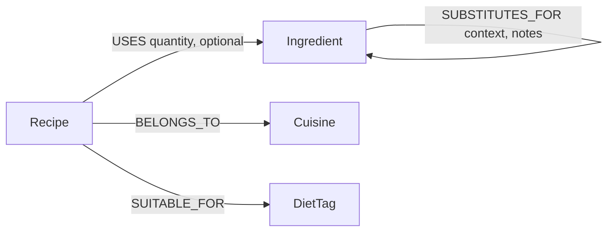

# PantryGraph

A recipe explorer backed by a graph database. Tell it what's in your kitchen and it finds every
recipe you can cook — including recipes you can make by substituting an ingredient you already
have, following substitution chains up to two steps deep (e.g. no buttermilk? plain yogurt works;
no yogurt either? Greek yogurt is one more hop away).

Built for the Wexa AI take-home assignment, using **CognoDB** as the graph database layer.

> **Screen recording:** _add link here_
> **Hosted demo:** _add link here_

## Table of contents

- [Why a graph database?](#why-a-graph-database)
- [Data model](#data-model)
- [Tech stack](#tech-stack)
- [Setup](#setup)
- [Running the app](#running-the-app)
- [The core queries, explained](#the-core-queries-explained)
- [Project structure](#project-structure)
- [Error handling](#error-handling)
- [Screenshots](#screenshots)
- [Deployment](#deployment)

## Why a graph database?

The interesting question in this app isn't "what recipes exist" — that's a simple filter, and a
relational table handles it fine. The interesting question is: **"given what I have, and what I
could reasonably swap in, what can I actually cook?"** That question is fundamentally about
*reachability* through a chain of relationships, and it's where a relational schema starts to
strain:

- **Substitution is a graph, not a lookup table.** Butter can be replaced by vegan butter, coconut
  oil, or applesauce; applesauce can *also* replace eggs; Greek yogurt can replace sour cream, and
  plain yogurt can replace buttermilk. These chains are arbitrary-depth and branch in different
  directions depending on the ingredient. Modeling "reachable within N substitutions" in SQL means
  a recursive CTE with manual depth-limiting and cycle protection, re-derived for every query that
  needs it. In Cypher it's a single relationship pattern: `(a)-[:SUBSTITUTES_FOR*0..2]->(b)`.
- **"Which recipes are connected by shared ingredients" is a fan-out join in SQL.** Finding recipes
  that share two or more ingredients with a given recipe means self-joining the recipe-ingredient
  table, grouping, and filtering by count — awkward to write and awkward to read. In Cypher it's a
  two-hop traversal: `(r:Recipe)-[:USES]->(:Ingredient)<-[:USES]-(other:Recipe)`.
- **"What's the shortest substitution path between X and Y?"** has no fixed depth at all — it could
  be 1 hop or 5. This needs `shortestPath()`, which Cypher provides natively over a variable-length
  relationship pattern. In SQL this is the textbook case for a recursive CTE, and even then you're
  hand-rolling Dijkstra/BFS logic that a graph database gives you as a language primitive.

None of this is impossible in SQL — it's just the wrong tool. The moment "how are these things
connected, and how far apart are they" becomes the central question, modeling the domain as a graph
stops being a stylistic choice and starts being the more honest representation of the data.

## Data model



**Nodes**

| Label | Properties | Example |
|---|---|---|
| `Recipe` | `id`, `name`, `description`, `instructions[]`, `prepTimeMinutes`, `servings`, `emoji` | Butter Chicken |
| `Ingredient` | `id`, `name`, `category` | Buttermilk, category `Dairy` |
| `Cuisine` | `name` | Indian |
| `DietTag` | `name` | Vegan, Gluten-Free |

**Relationships**

| Type | Direction | Properties | Meaning |
|---|---|---|---|
| `USES` | `Recipe → Ingredient` | `quantity`, `optional` | This recipe calls for this ingredient |
| `BELONGS_TO` | `Recipe → Cuisine` | — | This recipe's cuisine |
| `SUITABLE_FOR` | `Recipe → DietTag` | — | This recipe satisfies this diet |
| `SUBSTITUTES_FOR` | `Ingredient → Ingredient` | `context`, `notes` | The source ingredient can replace the target (directed — not always symmetric, e.g. applesauce replaces butter for less fat, but butter doesn't "replace" applesauce the same way) |

The seed data (`scripts/seed.ts`) loads ~135 ingredients, 8 cuisines, 6 diet tags, ~35 recipes, and
~45 substitution edges — enough to make the substitution chains genuinely interesting without
overloading the free-tier instance.

## Tech stack

- **Next.js 16 (App Router) + TypeScript** — one deployable for both the UI and the API layer
- **Tailwind CSS v4** — styling
- **`neo4j-driver`** (official) — the only thing that talks to CognoDB; all queries are parameterized
- **CognoDB Cloud** — the graph database, speaking openCypher over Bolt
- Deployed on **Vercel**

## Setup

### 1. Create your CognoDB instance

1. Sign up at [console.cognodb.com/signup](https://console.cognodb.com/signup) (free, no card).
2. Create a free `c0` instance and pick a region — provisioning takes under a minute.
3. From the instance's **Connect** panel, copy the `bolt+s://<instance-id>.databases.cognodb.cloud`
   URI and the generated password for user `cognodb`. **The password is shown once** — save it now.

### 2. Configure the app

```bash
cp .env.example .env.local
```

Fill in `.env.local`:

```
NEO4J_URI=bolt+s://<your-instance-id>.databases.cognodb.cloud
NEO4J_USER=cognodb
NEO4J_PASSWORD=<your-generated-password>
```

`.env.local` is git-ignored — nothing here ever gets committed.

### 3. Install dependencies

```bash
npm install
```

### 4. Seed the database

```bash
npm run seed
```

This is idempotent (everything is `MERGE`d), so it's safe to re-run. It also creates uniqueness
constraints on `Recipe.id`, `Ingredient.name`, `Cuisine.name` and `DietTag.name`.

## Running the app

```bash
npm run dev
```

Visit `http://localhost:3000`. Three pages:

- **`/`** — browse and filter all recipes
- **`/pantry`** — "What can I cook?": add ingredients, get ranked recipe matches with direct and
  substituted-ingredient breakdowns
- **`/explore`** — pick an ingredient to see its substitution neighborhood, or find the shortest
  substitution path between any two ingredients

## The core queries, explained

All queries live in [`src/lib/queries.ts`](src/lib/queries.ts) and run through the shared,
parameterized `withSession` helper in [`src/lib/neo4j.ts`](src/lib/neo4j.ts) — no query is ever
built by string concatenation.

### 1. Pantry match (multi-hop, ≥2 hops) — `pantryMatch()`

```cypher
MATCH path = (start:Ingredient)-[:SUBSTITUTES_FOR*0..2]->(avail:Ingredient)
WHERE toLower(start.name) IN [n IN $pantry | toLower(n)]
RETURN avail.name AS ingredient, start.name AS pantryItem, min(length(path)) AS hops
```

Starting from every ingredient the user has, this walks up to two `SUBSTITUTES_FOR` hops outward
(`*0..2` — zero hops includes the pantry item itself) and returns every ingredient that's reachable,
tagged with how many substitution steps it took. The app then scores each recipe by how much of its
ingredient list is covered directly (0 hops) or via substitution (1–2 hops), and what's still
missing. This is the query the assignment asks for a multi-hop traversal on, and it's also the one
a relational schema would handle worst — see [Why a graph database](#why-a-graph-database).

### 2. Shortest substitution path (awkward for SQL) — `substitutionPath()`

```cypher
MATCH (a:Ingredient {name: $from}), (b:Ingredient {name: $to})
MATCH path = shortestPath((a)-[:SUBSTITUTES_FOR*..6]-(b))
RETURN [n IN nodes(path) | n.name] AS names,
       [rel IN relationships(path) | type(rel)] AS rels,
       length(path) AS hops
```

Finds the shortest chain of substitutions between any two ingredients, with no fixed depth (capped
at 6 as a sanity bound, not a modeling assumption). `shortestPath()` over a variable-length pattern
is a Cypher primitive; in SQL this needs a recursive CTE that manually implements BFS and guards
against cycles.

### 3. Related recipes (2-hop traversal) — `relatedRecipes()`

```cypher
MATCH (r:Recipe {id: $id})-[:USES]->(ing:Ingredient)<-[:USES]-(other:Recipe)
WHERE other.id <> $id
WITH other, collect(DISTINCT ing.name) AS shared
WHERE size(shared) >= $minShared
...
```

Recipe → Ingredient → Recipe: two hops out and back to find recipes sharing at least two
ingredients with the current one. In SQL this is a self-join on the recipe-ingredient bridge table
with a `GROUP BY` and `HAVING COUNT(*) >= 2` — it works, but it reads like a join you have to
decode rather than a relationship you can see.

### 4. Ingredient substitution neighborhood — `ingredientSubstituteNeighborhood()`

Two 1–2 hop queries (outgoing and incoming `SUBSTITUTES_FOR`) that power the `/explore` page's
"can replace" / "can be replaced by" columns, with direct (1-hop) substitutions annotated with the
stored `notes` property.

### 5. Everything else

`listRecipes`, `getRecipeDetail`, `listCuisines`, `listDietTags`, `searchIngredientNames` are
single-hop, filtered lookups — the parts of the app that *would* be comfortable as SQL, included
for a complete, usable application rather than as graph showpieces.

### A CognoDB quirk found while testing against the live instance

The first version of `ingredientSubstituteNeighborhood()` tried to fetch a substitution's `notes`
in one pass: a reachability `MATCH ... WITH ... min(length(path))`, followed by an `OPTIONAL MATCH`
that re-matched the direct edge using a parameterized node filter (`{name: $name}`) to grab its
`notes` property. Against the live instance this silently returned notes from unrelated edges (e.g.
asking for what can replace "Butter" pulled in the note text from an unrelated "Applesauce →
Egg" edge) — the parameterized property filter on the fresh node pattern wasn't being applied once
it followed a `WITH` aggregation. A plain `MATCH` for the same filter, with no preceding `WITH`,
filtered correctly every time. The fix in `queries.ts` splits it into two single-purpose queries
(reachability, then direct-edge notes) joined in application code — also sequential rather than
`Promise.all`, since a single driver `Session` can't run two pieces of work concurrently. Both
issues were caught by exercising the UI end-to-end against the real instance rather than trusting
the queries in isolation, and are commented in place in `queries.ts`.

## Project structure

```
src/
  app/
    page.tsx                  Browse/search recipes (client, filters via /api/recipes)
    recipes/[id]/page.tsx     Recipe detail (server component, queries CognoDB directly)
    pantry/page.tsx           "What can I cook?" — the pantry-match feature
    explore/page.tsx          Substitution neighborhood + shortest-path finder
    api/                      Route handlers — the HTTP boundary for client-driven queries
  components/                 Presentational + interactive UI pieces
  lib/
    neo4j.ts                  Driver singleton, session helper, typed connection errors
    queries.ts                Every Cypher query, parameterized
    types.ts                  Shared TypeScript types
    apiError.ts                Maps DB errors to HTTP responses
scripts/
  seed.ts                     Idempotent data loader
```

Recipe listing/detail pages fetch directly from `lib/queries.ts` inside React Server Components
(no HTTP round-trip needed for an initial page load). The interactive pages — pantry matching,
ingredient exploration, filtering — go through `api/` routes, since they need to re-query after the
page has already loaded.

## Error handling

`lib/neo4j.ts` wraps every driver failure (instance paused, network unreachable, bad credentials)
into a `DbConnectionError`. API routes catch it and return `503` with a clear message; the recipe
detail page (a server component) catches it and renders the same `ErrorState` component client
pages use when a `fetch` fails — so "CognoDB is unreachable" looks and reads the same everywhere in
the app, with a retry action where the page supports it.

## Screenshots

_Add screenshots of `/`, `/pantry` (with results), and `/explore` (with a path found) here before
submitting._

## Deployment

1. Push this repo to GitHub.
2. Import it into [Vercel](https://vercel.com/new).
3. Add `NEO4J_URI`, `NEO4J_USER`, `NEO4J_PASSWORD` as environment variables in the Vercel project
   settings (same values as `.env.local`).
4. Deploy. Vercel's Node.js serverless runtime supports the raw TCP connections the Bolt protocol
   needs — no extra configuration required.
5. Keep the CognoDB instance running after submitting, in case it needs to be tested live.
